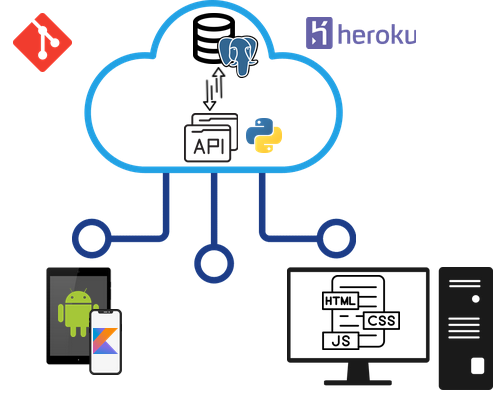

# Projeto Integrador III

# Agenda escolar digital

Sistema digital de registro de atividade escolar aplicado à educação infantil, de forma a substituir a utilização de agendas físicas em papel por aplicação web e mobile, garantindo uma comunicação efetiva entre os agentes cuidadores/formadores e os pais.

Este projeto tem por objetivo possibilitar um registro e acompanhamento mais detalhado dos atividades das crianças e uma comunicação mais efetiva com os pais, bem como a possibilidade de identificação de padrões comportamentais, possibilitando um cenário realista para a utilização e desenvolvimento de competências e ferramentas do curso.

## Equipe do Projeto Integrador

| RA      | Nome                               | Curso            | Unidade |
|:-------:|:----------------------------------:|:----------------:|:--------|
| 2012272 | André Santos Barros da Silva       | Ciência de Dados |         |
| 1712316 | José Vilson Bezerra de Albuquerque | Eng. Computação  |         |
| 2004712 | José William Rodrigues Pereira     | Ciência de Dados |         |
| 2009113 | Marcelo Martins Ribeiro dos Santos | Eng. Computação  | Barueri |
| 2008166 | Rideu Santos Barros da Silva       | Ciência de Dados |         |
| 1835382 | João Clemente Olivera Moraes       |                  |         |
| 1600438 | Lucas Muniz Moreira                |  Eng. Computação |         |
||||

## Quando?

## Onde?

## Estrutura do Projeto

### Estrutura e ferramentas
* Nuvem
    * Banco de dados
        * Postgres
    * APIs
        * Flask
* App Mobile
    * Kotlin/ReactJS
* Aplicação Web
    * HTML/CSS/JS

### Análise de dados
* Reconhecimento de padrões

### Controle de versão
* Git/GitHub

## Quanto?
